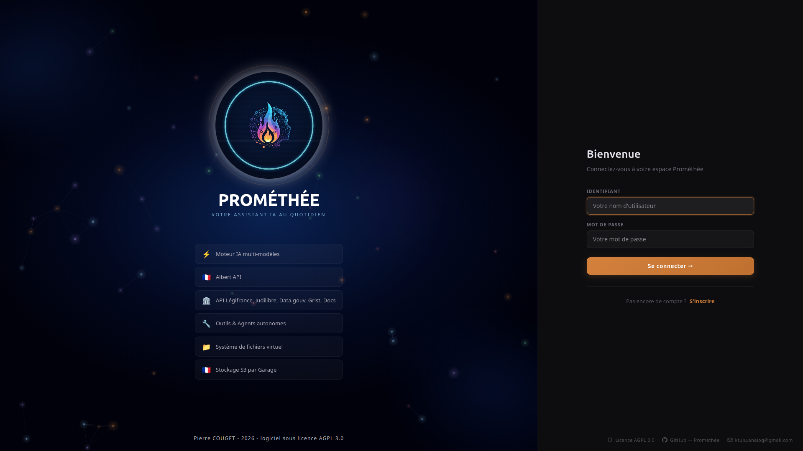
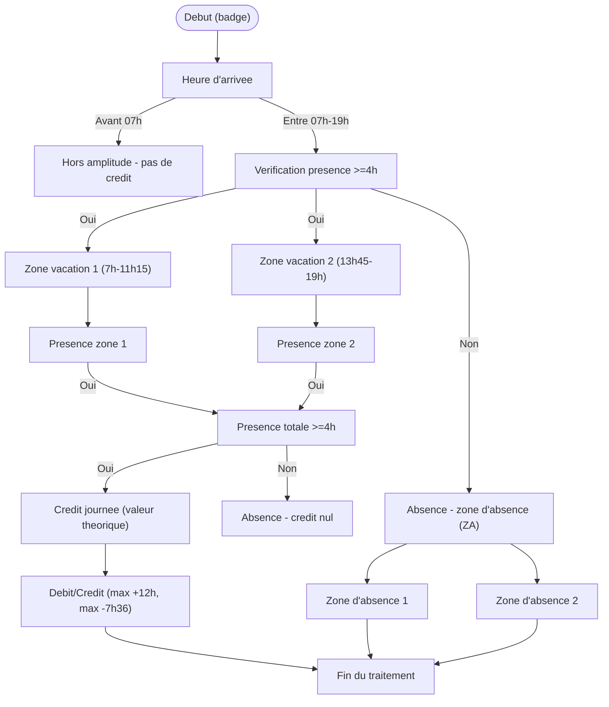

# 🔥 Prométhée AI v3.0





- **Assistant IA web** — Interface FastAPI + React connectée à un LLM (Albert API, OpenAI-compatible), avec outils intégrés, RAG, mémoire long terme et support Légifrance/Judilibre.
- **Système de fichiers virtuel** - les utilisateurs disposent d'un espace de stockage (utilisé par le LLM et les outils) compatible S3 via Garage.
- **Conçu principalement pour fonctionner avec l'API Albert de la DiNum**

---

## 📋 Changelog

### v3.0
- 📚 Application multi-utilisateurs FastAPI-React (suppression du mode desktop mono-utilisateur)
- 📚 VFS avec Garage (stockage compatible S3)
- 📊 Rendu de graphiques avec echarts (typiquement depuis un fichier .csv ou tableur)
- 🐛 Corrections de bugs dans les outils (encore pas mal de travail pour Légifrance)
- 🐛 Rajouts de bugs un peu partout (un peu comme une chasse aux oeufs)


### v2.2.4
- 📚 **Rajout de l'export structuré** du contenu de la réponse vers Word/LibreOffice. L'utilisateur peut choisir un copier/coller brut (markdown) ou riche (type RTF) depuis l'interface de chat.
    Pratique pour faire de la récupération rapide de contenu sans passer par les outils d'export.
- 🐛 Corrections de bugs sur des cas limites dans le RAG


### v2.2.3
- 🐛 Corrections de bugs dans le rendu LaTeX et Mermaid
- 🔧 **Rajout d'un outil** pour reformuler les comptes rendus oraux dans un style adapté à l'écrit
- 💬 **Rajout du profil associé** à cet outil (Rédacteur) et d'un skill dédié.


### v2.2.2
- 🐛 Corrections de bugs dans le RAG avec Qdrant


### v2.2.1
- 🐛 Corrections de bugs sur l'affichage des images dans le chat
- 🎨 Correctifs divers sur l'interface utilisateur
- 🧠 Amélioration de la mémoire long terme (LTM) : réduction des souvenirs parasites
- 🗑️ Suppression de la mémoire long terme possible depuis l'interface
- 🔧 Refactorisation de plusieurs scripts pour améliorer la maintenabilité et contenir leur taille

---

## ✨ Fonctionnalités

- 💬 **Chat en streaming** avec historique chiffré (AES-GCM)
- 🧠 **Mémoire long terme (LTM)** : résumés vectorisés des conversations passées via Qdrant, avec suppression possible depuis l'interface
- 🔧 **Outils intégrés** : web, données, export (docx/pptx/pdf/xlsx), Grist, analyse de données, Python, SQL, OCR, météo, messagerie IMAP/SMTP, Légifrance, Judilibre, data.gouv.fr, génération automatique d'outils
- 🗂️ **Système de fichiers virtuel (VFS)** : le LLM travaille dans un espace de fichiers isolé par utilisateur, stocké en SQLite — aucune écriture sur le disque réel du serveur
- 📚 **RAG** (Retrieval-Augmented Generation) via Qdrant et Albert API
- 📊 **Outils collaboratifs** : intégration de l'API Grist
- 🏛️ **APIs juridiques** : Légifrance et Judilibre via PISTE
- 🔒 **Chiffrement optionnel** de la base de données SQLite
- 🎨 **Thème clair/sombre**

---

## 🚀 Installation

Deux modes d'installation sont disponibles selon l'usage :

| Mode | Cas d'usage |
|---|---|
| [🧑‍💻 Développement local (venv)](#-développement-local-avec-venv) | Modifier le code, tester, contribuer |
| [🐳 Production (Docker)](#-déploiement-en-production-avec-docker) | Déployer une instance stable multi-utilisateur |

---

## 🧑‍💻 Développement local avec venv

Ce mode lance le backend Python et le frontend React séparément. Idéal pour développer et tester des modifications.

### Prérequis

- Python **3.11+** (testé avec 3.12.8)
- Node.js (pour le frontend React)
- Dépendances système selon les fonctionnalités activées (OCR, export PDF, LibreOffice…) → voir [`SYSTEM_DEPENDENCIES.md`](SYSTEM_DEPENDENCIES.md)

Installation minimale pour l'OCR :
```bash
# Ubuntu/Debian
sudo apt install tesseract-ocr tesseract-ocr-fra tesseract-ocr-eng

# macOS
brew install tesseract tesseract-lang
```

### Installation

```bash
# Cloner le dépôt
git clone https://github.com/Ktulu-Analog/promethee.git
cd promethee

# Créer et activer l'environnement virtuel
python -m venv .venv
source .venv/bin/activate  # Linux/macOS
# .venv\Scripts\activate   # Windows

# Installer les dépendances Python
pip install -r requirements.txt
```

### Configuration

```bash
cp .env.example .env
nano .env
```

Les paramètres essentiels à configurer dans `.env` :

| Variable | Description |
|---|---|
| `APP_VERSION` | Numéro de version affiché dans l'interface (ex : `3.0.0`) |
| `OPENAI_API_KEY` | Clé API (Albert, OpenAI, etc.) |
| `OPENAI_API_BASE` | URL du serveur LLM |
| `OPENAI_MODEL` | Modèle à utiliser |
| `OAUTH_CLIENT_ID` | Identifiants PISTE (Légifrance / Judilibre) |
| `QDRANT_URL` | URL Qdrant pour le RAG |
| `GRIST_API_KEY` | Clé API Grist |
| `GRIST_BASE_URL` | URL de l'instance Grist (défaut : `https://docs.getgrist.com`) |
| `IMAP_HOST` | Serveur IMAP pour la messagerie |
| `IMAP_PORT` | Port IMAP (défaut : 993) |
| `IMAP_USER` | Adresse e-mail |
| `IMAP_PASSWORD` | Mot de passe IMAP |
| `SMTP_HOST` | Serveur SMTP pour l'envoi *(optionnel)* |
| `SMTP_PORT` | Port SMTP *(optionnel)* |

### Lancement

**Backend (FastAPI) :**
```bash
python main.py
# ou directement :
uvicorn server.main:app --reload --port 8000
```

**Frontend React :**
```bash
cd frontend
npm install
npm run dev
# Interface disponible sur http://localhost:5173
```

> En développement, le frontend (port 5173) proxifie les requêtes API vers le backend (port 8000).  
> Pour un build de production servi par FastAPI : `npm run build` — l'interface sera alors sur http://localhost:8000.

---

## 🐳 Déploiement en production avec Docker

Ce mode déploie la pile complète (Prométhée + Qdrant + Garage S3) via Docker Compose. C'est la méthode recommandée pour une utilisation en production.

> 📖 **Documentation complète** : [`documentation/promethee_guide_installation.pdf`](documentation/promethee_guide_installation.pdf)  
> Ce guide couvre l'architecture, le dépannage et la référence complète des variables d'environnement.

### Prérequis

- Docker Engine 24.x ou supérieur
- Docker Compose v2.x
- Ports libres sur l'hôte : **8000** (app), **6333/6334** (Qdrant), **3900/3901** (Garage)

### Étape 1 — Configurer le fichier `.env`

```bash
cp .env.example .env
```

Renseignez au minimum ces variables dans `.env` :

| Variable | Description |
|---|---|
| `PROMETHEE_SECRET_KEY` | Clé secrète JWT — générer avec `openssl rand -hex 32` |
| `GARAGE_RPC_SECRET` | Secret partagé Garage — générer avec `openssl rand -hex 32` |
| `GARAGE_ACCESS_KEY` | Identifiant clé S3 (format : `GK` + 24 hex) |
| `GARAGE_SECRET_KEY` | Secret clé S3 (64 hex) — générer avec `openssl rand -hex 32` |
| `GARAGE_NODE_ID` | Laisser vide pour l'instant (voir Étape 2) |

### Étape 2 — Récupérer le `GARAGE_NODE_ID` ⚠️

C'est l'étape critique : Garage génère un identifiant unique au premier démarrage, qu'il faut récupérer avant de lancer la pile complète.

```bash
# 1. Démarrer uniquement Garage
docker compose up -d garage

# 2. Attendre qu'il soit au statut **healthy**, puis récupérer le Node ID
docker exec promethee-garage /garage -c /etc/garage/garage.toml node id
```

La commande affiche une sortie de ce type :
```
56f7d01ee626b9672eb88de512607f13a79c53cb90b8f5d2195bd40cf6b147d6@garage:3901
```

Copiez uniquement la partie **avant le `@`** et ajoutez-la dans `.env` :
```env
GARAGE_NODE_ID=56f7d01ee626b9672eb88de512607f13a79c53cb90b8f5d2195bd40cf6b147d6
```

### Étape 3 — Lancer la pile complète

```bash
docker compose up -d --build
```

Le premier build peut prendre plusieurs minutes (compilation frontend React, installation des paquets Python, téléchargement de KaTeX et Mermaid).

Suivez les logs en temps réel :
```bash
docker compose logs -f
```

### Vérification

```bash
docker compose ps
```

✅ Résultat attendu : `promethee`, `qdrant` et `garage` affichent `Up ... (healthy)`. Les services one-shot `garage-config` et `garage-init` affichent `Exited (0)`.

L'application est accessible sur **http://localhost:8000**.

---

## 📁 Structure du projet

```
promethee/
├── core/                        # Moteur applicatif
│   ├── config.py                # Variables d'environnement et paramètres globaux
│   ├── database.py              # Accès SQLite (conversations, utilisateurs, VFS)
│   ├── crypto.py                # Chiffrement AES-GCM de la base de données
│   ├── llm_clients.py           # Clients LLM (Albert, OpenAI-compatible, Ollama)
│   ├── llm_service.py           # Orchestration de la boucle agent (streaming)
│   ├── llm_events.py            # Événements SSE / WebSocket
│   ├── llm_logging.py           # Journalisation des appels LLM
│   ├── context_manager.py       # Gestion et consolidation du contexte
│   ├── session_memory.py        # Mémoire de session (historique en cours)
│   ├── long_term_memory.py      # Mémoire long terme vectorisée (Qdrant)
│   ├── rag_engine.py            # Moteur RAG (ingestion + recherche Qdrant)
│   ├── ocr_engine.py            # OCR via Tesseract
│   ├── tools_engine.py          # Chargement et dispatch des outils
│   ├── skill_manager.py         # Injection dynamique des skills en contexte
│   ├── virtual_fs.py            # Système de fichiers virtuel (VFS SQLite)
│   ├── user_manager.py          # Gestion des utilisateurs et authentification
│   ├── user_config.py           # Préférences utilisateur
│   └── request_context.py       # Contexte de requête (session, user, tools)
│
├── tools/                       # Outils disponibles pour l'agent
│   ├── web_tools.py             # Navigation, scraping, DuckDuckGo / SearXNG
│   ├── export_tools.py          # Génération docx, pptx, pdf, xlsx, odt…
│   ├── export_template_tools.py # Export depuis gabarits organisationnels
│   ├── data_tools.py            # Manipulation et analyse de données
│   ├── data_file_tools.py       # Chargement et transformation CSV/Excel (pandas)
│   ├── docs_tools.py            # Lecture de documents (PDF, docx…)
│   ├── ocr_tools.py             # OCR via Tesseract
│   ├── vfs_tools.py             # Opérations VFS (lecture, écriture, archives…)
│   ├── skill_tools.py           # Consultation dynamique des guides de compétences
│   ├── reformulation_tools.py   # Reformulation de comptes rendus oraux
│   ├── meteo_tools.py           # Météo via Open-Meteo (sans clé API)
│   ├── imap_tools.py            # Messagerie IMAP/SMTP
│   ├── grist_tools.py           # API Grist (tableurs collaboratifs)
│   ├── legifrance_tools.py      # API Légifrance (PISTE)
│   ├── judilibre_tools.py       # API Judilibre (PISTE)
│   ├── datagouv_tools.py        # API data.gouv.fr
│   └── tool_creator_tools.py    # Génération automatique d'un nouvel outil
│
├── server/                      # API FastAPI (backend)
│   ├── main.py                  # Point d'entrée uvicorn, montage des routers
│   ├── deps.py                  # Dépendances FastAPI (auth, session…)
│   ├── schemas.py               # Schémas Pydantic (requêtes / réponses)
│   ├── WS_PROTOCOL.md           # Documentation du protocole WebSocket
│   └── routers/                 # Endpoints REST + WebSocket
│       ├── ws_chat.py           # WebSocket de chat (boucle agent)
│       ├── auth.py              # Authentification (login, JWT, unlock)
│       ├── conversations.py     # CRUD conversations
│       ├── settings.py          # Paramètres utilisateur
│       ├── profiles_skills.py   # Profils et skills
│       ├── rag.py               # Endpoints RAG (recherche, collections)
│       ├── ingest_admin.py      # Ingestion de documents (RAG)
│       ├── upload.py            # Upload de fichiers vers le VFS
│       ├── vfs_router.py        # API VFS (liste, download, quota)
│       ├── tools_router.py      # Endpoints outils
│       ├── admin.py             # Administration (utilisateurs, stats)
│       └── monitoring.py        # Healthcheck et métriques
│
├── frontend/                    # Interface React (Vite + TypeScript)
│   ├── index.html
│   ├── vite.config.ts
│   ├── tsconfig.json
│   ├── package.json
│   └── src/
│       ├── App.tsx              # Composant racine, routing
│       ├── main.tsx             # Point d'entrée React
│       ├── components/
│       │   ├── chat/
│       │   │   ├── ChatPanel.tsx        # Panneau de chat principal
│       │   │   ├── ChatInput.tsx        # Zone de saisie
│       │   │   ├── MessageBubble.tsx    # Rendu d'un message
│       │   │   ├── ArtifactPanel.tsx    # Panneau artefacts (code, fichiers)
│       │   │   ├── EChartsBlock.tsx     # Rendu de graphiques ECharts
│       │   │   ├── MermaidBlock.tsx     # Rendu de diagrammes Mermaid
│       │   │   └── MetricsBar.tsx       # Barre de métriques (tokens, temps…)
│       │   ├── sidebar/
│       │   │   ├── ConvSidePanel.tsx    # Panneau latéral conversations
│       │   │   ├── ConvItem.tsx         # Item de conversation
│       │   │   ├── DiscussionsPanel.tsx # Liste des discussions
│       │   │   ├── SidebarFooter.tsx    # Pied de sidebar
│       │   │   ├── SidebarRail.tsx      # Rail de navigation
│       │   │   └── ConfirmModal.tsx     # Modale de confirmation
│       │   ├── settings/
│       │   │   ├── SettingsDialog.tsx
│       │   │   ├── TabModel.tsx         # Onglet modèle LLM
│       │   │   ├── TabApiKeys.tsx       # Onglet clés API
│       │   │   ├── TabOutils.tsx        # Onglet outils
│       │   │   └── TabsExtra.tsx        # Onglets supplémentaires
│       │   ├── admin/
│       │   │   ├── AdminPanel.tsx       # Panneau d'administration
│       │   │   └── IngestPanel.tsx      # Ingestion de documents RAG
│       │   ├── profiles/    ProfilesPanel.tsx
│       │   ├── projects/    ProjectsPanel.tsx
│       │   ├── rag/         RagPanel.tsx
│       │   ├── tools/       ToolsPanel.tsx
│       │   ├── vfs/         VfsPanel.tsx
│       │   ├── auth/        LoginScreen.tsx
│       │   └── ui/          # Composants UI génériques (ThemeSwitch, icons…)
│       ├── hooks/                       # Hooks React personnalisés
│       │   ├── useAgentStream.ts        # Streaming WebSocket agent
│       │   ├── useArtifactPanel.ts      # Gestion du panneau artefacts
│       │   ├── useConversationTree.ts   # Arbre de conversation
│       │   ├── useAuth.ts
│       │   ├── useSettings.ts
│       │   └── useSplitPane.ts
│       ├── lib/                         # Utilitaires
│       │   ├── api.ts                   # Client HTTP (fetch wrapper)
│       │   ├── markdownToHtml.ts        # Rendu Markdown → HTML
│       │   └── useTheme.ts
│       └── styles/
│           └── theme.css               # Variables CSS / thème clair-sombre
│
├── skills/                      # Guides de compétences injectés en contexte LLM
├── scripts/                     # Scripts utilitaires (à exécuter une fois)
│   ├── download_katex.py        # Télécharge les assets KaTeX dans assets/katex/
│   └── download_mermaid.py      # Télécharge Mermaid.js dans assets/mermaid/
├── documentation/               # Documentation technique
│   ├── promethee_guide_installation.pdf  # Guide d'installation Docker
│   ├── doc_developpeur_tools.pdf         # Guide développeur outils
│   └── modele_tools.py                   # Modèle de référence pour créer un outil
├── main.py                      # Point d'entrée de l'application
├── prompts.yml                  # Prompts système
├── pyproject.toml               # Métadonnées du projet Python
├── requirements.txt             # Dépendances Python
├── docker-compose.yml           # Stack Docker complète (5 services)
├── Dockerfile                   # Image Docker Prométhée (FastAPI + React)
├── Dockerfile.garage-init       # Image one-shot pour l'initialisation Garage
├── garage.toml                  # Configuration Garage (stockage S3)
├── SYSTEM_DEPENDENCIES.md       # Dépendances système requises
├── CONTRIBUTING.md              # Guide de contribution
└── .env.example                 # Modèle de configuration
```

---

## 🎨 Rendu riche : LaTeX, Mermaid et ECharts

Prométhée intègre un moteur de rendu LaTeX, Mermaid et ECharts dans le chat, fonctionnant entièrement en local grâce à des assets embarqués.

### Formules LaTeX — KaTeX

Les formules mathématiques sont rendues via **KaTeX** (assets locaux, aucune connexion requise).

| Syntaxe | Mode | Exemple |
|---|---|---|
| `$ ... $` ou `\( ... \)` | Inline (dans le texte) | `$E = mc^2$` |
| `$$ ... $$` ou `\[ ... \]` | Display (bloc centré) | `$$\int_0^\infty e^{-x}\,dx$$` |

> **Note :** les dollars monétaires (`$42`, `USD$`) sont automatiquement ignorés grâce à une heuristique anti-faux-positifs.

Pour télécharger les assets KaTeX (à exécuter une seule fois après le clonage) :
```bash
python scripts/download_katex.py
```

### Diagrammes Mermaid (version préliminaire)

Les blocs ` ```mermaid ` sont rendus en SVG via **Mermaid.js** (v11.14.0, bundle local).

Tous les types de diagrammes sont supportés : flowchart, séquence, Gantt, état, classe, entité-relation, Sankey, etc.
**Il reste des erreurs dans le moteur de rendu, notamment sur les accents. Ceci est en cours de correction pour une prochaine version**

Voici un exemple de rendu par Prométhée avec Mermaid :
*(prompt : à partir de ce rapport, génère un diagramme de flux pour présenter le système d'horaires souples)*



Pour télécharger l'asset Mermaid (à exécuter une seule fois après le clonage) :
```bash
python scripts/download_mermaid.py
```

### Graphiques interactifs — ECharts

Les blocs de données structurées sont rendus en graphiques interactifs via **Apache ECharts**, directement dans le chat. L'agent peut générer des barres, courbes, camemberts, graphiques radar, cartes de chaleur, etc., à partir de fichiers CSV, tableurs ou de données fournies dans la conversation.

Exemple de prompt déclencheur :
> *« À partir de ce fichier CSV, génère un graphique en barres empilées par service et par mois. »*

Le LLM produit une configuration ECharts JSON que le composant `EChartsBlock.tsx` interprète et rend côté client — aucun rendu serveur, aucune dépendance externe.

Types de graphiques supportés : barres, courbes, aires, camemberts, nuages de points, radar, Sankey, cartes de chaleur, et tous les types ECharts standards.

---

## 🛠️ Outils disponibles

| Outil | Description |
|---|---|
| `web_tools` | Recherche DuckDuckGo / SearXNG, scraping, capture d'écran, extraction de contenu |
| `export_tools` | Génération docx, pptx, xlsx, pdf, md, odt/odp/ods (LibreOffice) |
| `export_template_tools` | Génération docx et pptx depuis un gabarit organisationnel |
| `data_tools` | Manipulation de données, calculs sur dates/heures, expressions régulières |
| `data_file_tools` | Chargement, exploration et transformation de fichiers CSV/Excel (pandas) |
| `ocr_tools` | OCR via Tesseract (images et PDF scannés), détection automatique |
| `vfs_tools` | Système de fichiers virtuel : lecture, écriture, navigation, archives, diff (20 outils) |
| `skill_tools` | Consultation dynamique des guides de compétences injectés en contexte |
| `reformulation_tools` | Reformulation de transcriptions orales (.docx) dans un style écrit |
| `meteo_tools` | Météo actuelle et prévisions 7 jours via Open-Meteo (sans clé API) |
| `imap_tools` | Lecture, recherche, envoi et gestion d'e-mails via IMAP/SMTP |
| `tool_creator_tools` | Génération automatique d'un nouvel outil Prométhée par le LLM |
| `grist_tools` | API Grist : lecture et écriture dans des tableurs collaboratifs |
| `legifrance_tools` | API Légifrance (PISTE) : recherche et consultation de textes juridiques |
| `judilibre_tools` | API Judilibre (PISTE) : recherche de décisions de justice |
| `datagouv_tools` | API data.gouv.fr : recherche et téléchargement de jeux de données ouverts |

---

## 🛠️ Scripts utilitaires

| Script | Description |
|---|---|
| `scripts/download_katex.py` | Télécharge les assets KaTeX (JS, CSS, polices woff2) dans `assets/katex/`. À exécuter une seule fois après le clonage. |
| `scripts/download_mermaid.py` | Télécharge les assets Mermaid (mermaid.min.js) dans `assets/mermaid/`. À exécuter une seule fois après le clonage. |

---

## 🧪 Tests

> ⚠️ Le dossier `tests/` n'est pas inclus dans cette version. La publication des tests unitaires est prévue pour une version ultérieure.

```bash
# Structure cible (à venir)
pytest tests/
# Avec couverture :
pytest tests/ --cov=core --cov=tools
```

---

## 🗂️ Système de fichiers virtuel (VFS)

Le LLM ne lit et n'écrit **jamais** sur le disque réel du serveur. Toutes les opérations sur les fichiers passent par le VFS : un espace de travail isolé par utilisateur, stocké dans la base SQLite.

### Dossiers disponibles au premier démarrage

| Dossier | Usage |
|---|---|
| `/uploads` | Fichiers envoyés via l'interface |
| `/documents` | Documents de travail de l'agent |
| `/exports` | Fichiers produits (docx, xlsx, pdf…) |
| `/tmp` | Fichiers temporaires |

### Outils VFS (20 outils)

Le LLM dispose d'une famille d'outils `vfs_*` couvrant lecture, écriture, navigation, archives, diff et batch — voir le fichier `server/WS_PROTOCOL.md` pour le détail du protocole WebSocket, et le wiki GitHub pour la documentation VFS complète.

### Accès depuis l'interface React

```
GET  /vfs/list?path=/exports      → liste un dossier
GET  /vfs/download?path=/exports/rapport.docx  → téléchargement
GET  /vfs/quota                   → espace utilisé
```

### Limites

- Taille max par fichier : **50 MB**
- Isolation totale : un utilisateur ne peut pas accéder aux fichiers d'un autre


---

## ⚙️ Options avancées


### Chiffrement de la base de données

Dans `.env` :
```env
DB_ENCRYPTION=ON
```
Au premier lancement, appelez `POST /auth/unlock` avec votre passphrase avant tout autre appel API.


### Mémoire long terme (LTM)

La LTM stocke des résumés vectorisés des conversations passées dans Qdrant et les réinjecte automatiquement en contexte. Elle peut être entièrement effacée depuis l'interface. Configuration dans `.env` :

```env
LTM_ENABLED=ON
LTM_MODEL=mistralai/Mistral-Small-3.2-24B-Instruct-2506
LTM_USE_SUMMARY=OFF     # ON = résumés LLM (meilleure qualité), OFF = chunks bruts
LTM_RECENT_K=2          # Nombre de souvenirs récents réinjectés
```

### Gestion du contexte et de l'agent

```env
AGENT_MAX_ITERATIONS=12            # Nombre max d'itérations de la boucle agent
CONTEXT_CONSOLIDATION_EVERY=8      # Résumé de session tous les N tours
CONTEXT_CONSOLIDATION_PRESSURE_THRESHOLD=0.70  # Consolidation adaptative (% du contexte)
```

### Messagerie IMAP/SMTP

L'outil `imap_tools` offre une compatibilité universelle avec tout serveur IMAP/SMTP (Gmail, Outlook, Proton Mail, serveurs auto-hébergés…).

```env
IMAP_HOST=imap.example.com
IMAP_PORT=993
IMAP_USER=vous@example.com
IMAP_PASSWORD=votre_mot_de_passe
SMTP_HOST=smtp.example.com
SMTP_PORT=587
```

### Génération automatique d'outils

L'outil `tool_creator_tools` permet au LLM de générer un nouvel outil Prométhée à partir d'une description en langage naturel. Le code généré est validé syntaxiquement avant d'être écrit dans `tools/`.

---

## 📄 Licence

Ce projet est distribué sous licence **AGPL-3.0**.  
Voir [https://www.gnu.org/licenses/agpl-3.0.html](https://www.gnu.org/licenses/agpl-3.0.html).

---

## 👤 Auteur

Pierre COUGET — 2026
[](mailto:ktulu.analog@gmail.com)
