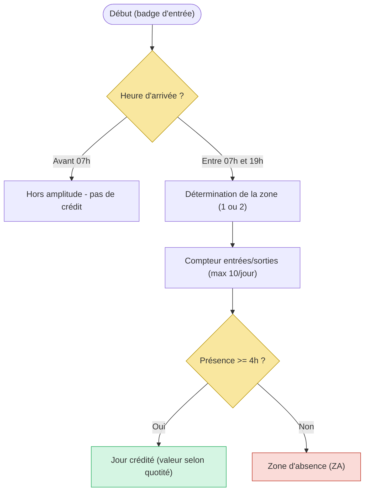
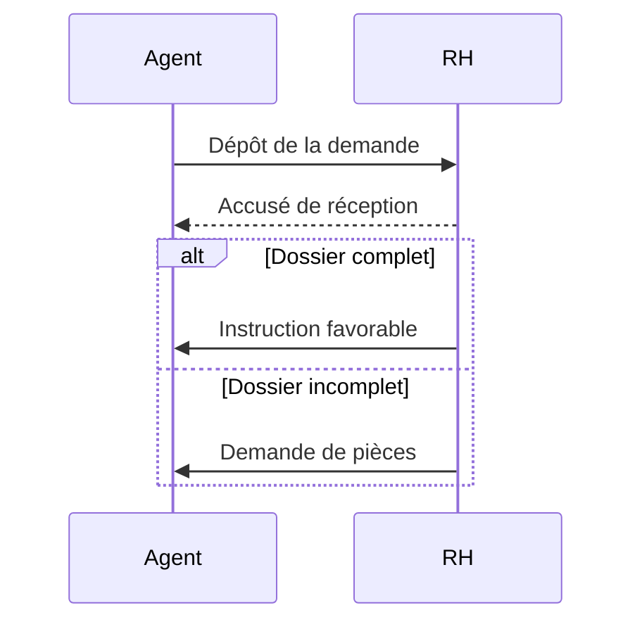
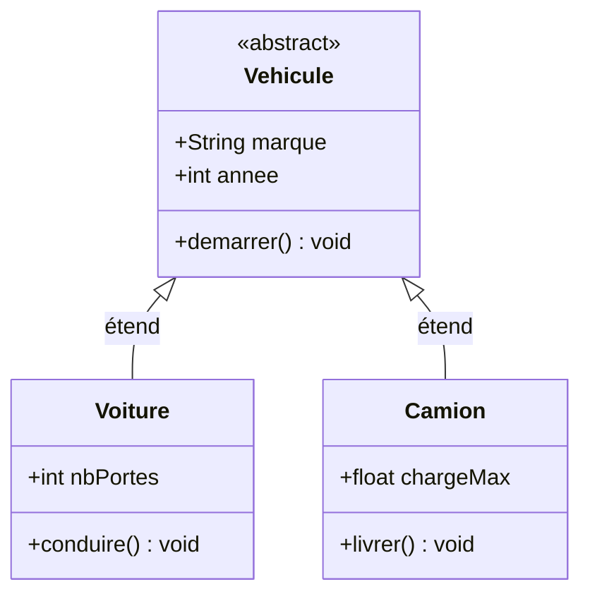
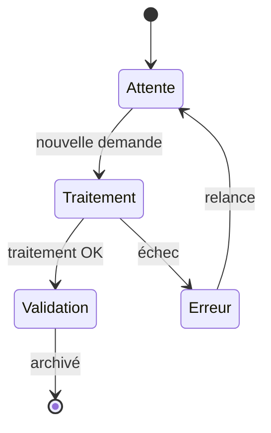
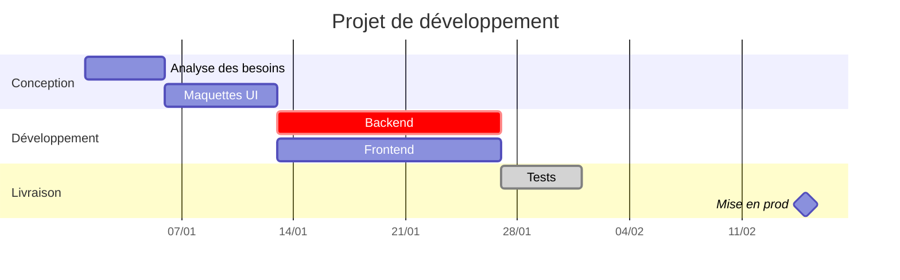
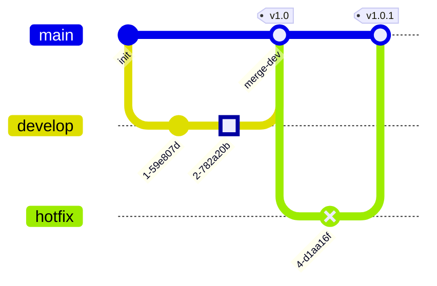

# Guide Mermaid — Syntaxe complète (Mermaid 11)

**Version Mermaid dans Prométhée : 11.x**
Lire ce guide entièrement avant de générer. Les erreurs de syntaxe rendent un
diagramme invisible dans l'interface.

---

## 0. Règles universelles

### 0.1 Structure du bloc

```
✅  ```mermaid
    flowchart TD
        A[Début] --> B[Fin]

❌  ```markdown
        ```mermaid ...
```

### 0.2 Commentaires

```
✅  %% Commentaire
❌  # Commentaire    ❌  ## Titre    ❌  // Commentaire
```

Pas de directive `%%{ init }%%`.

### 0.3 Caractères Unicode à éviter

- Tirets insécables `‑` → remplacer par `-`
- Espaces insécables → remplacer par espace normal
- Guillemets typographiques `"` `"` `«` `»` → supprimer ou remplacer par `'`

### 0.4 Labels avec parenthèses dans les flowcharts

**RÈGLE ABSOLUE : tout label `[...]` contenant `(` ou `)` DOIT être entre guillemets doubles.**

```
❌  A[Calcul du temps (cumul des durées)]
✅  A["Calcul du temps (cumul des durées)"]

❌  B[Badge "entrée"]       ← guillemets imbriqués = erreur
✅  B["Badge entrée"]       ← supprimer les " internes
✅  B["Badge 'entrée'"]     ← apostrophes simples OK

✅  C{Zone (A ou B)}        ← accolades {} acceptent les () sans guillemets
```

---

## 1. flowchart / graph

**En-tête** : `flowchart TD|LR|TB|RL|BT` (ou `graph`)

### Formes

```
A[Rectangle]   B(Arrondi)    C([Stadium])   D[[Sous-routine]]
E[(Cylindre)]  F((Cercle))   G{Losange}     H{{Hexagone}}
I[/Parallélogramme/]    J[\Alt\]
```

### Connexions

```
A --> B          flèche
A --- B          ligne
A -- texte --> B label
A -->|texte| B   label alt
A -.-> B         pointillé
A ==> B          épais
A --o B          cercle final
A --x B          croix finale
A <--> B         bidirectionnel
```

### Sous-graphes

```
subgraph titre ["Titre affiché"]
    direction LR
    A --> B
end
```

### IDs réservés interdits

```
end  start  subgraph  direction  state  note
loop  alt  else  opt  par  and  rect  left  right
click  call  href  link  linkStyle
```

```
❌  start([Début]) --> A        ✅  debut([Début]) --> A
❌  A --> end([Fin])            ✅  A --> fin([Fin])
```

### classDef

```
classDef vert fill:#D5F5E3,stroke:#27AE60
A:::vert --> B
class C,D vert
```

### Exemple



---

## 2. sequenceDiagram

```
sequenceDiagram
    participant A as Alice
    actor B as Bob
    A->>B: Message synchrone
    B-->>A: Réponse (pointillé)
    A-)B: Asynchrone
    A-xB: Message perdu
    Note over A,B: Note centrée
    Note right of A: Note à droite
```

### Blocs

```
alt Condition vraie
    A->>B: message
else Condition fausse
    A->>B: autre
end

loop Répétition
    A->>B: ping
end

opt Optionnel
    A->>B: si besoin
end

par En parallèle
    A->>B: action 1
and
    A->>C: action 2
end

rect rgb(200,220,255)
    A->>B: zone colorée
end
```

### Mots réservés interdits en début de ligne de texte

`else`, `end`, `loop`, `alt`, `opt`, `par`, `rect`, `break`, `and`, `note`

```
❌  A->>B: end of process        ✅  A->>B: fin du processus
❌  Note over B: else case       ✅  Note over B: cas alternatif
```

### Exemple



---

## 3. classDiagram

```
classDiagram
    class Animal {
        +String nom
        +int age
        +faireDuBruit() String
        #protectedMethod()
        -privateField int
    }
    class Chien {
        +aboyer() void
    }
    Animal <|-- Chien : hérite
```

### Visibilité : `+` public, `-` private, `#` protected, `~` package

### Relations

```
A <|-- B     héritage
A *-- B      composition
A o-- B      agrégation
A --> B      association
A -- B       lien simple
A ..> B      dépendance
A ..|> B     réalisation
```

### Cardinalités et annotations

```
Animal "1" --> "0..*" Patte : possède

class Interface {
    <<interface>>
    +methode() void
}
```

Les noms de méthodes ne doivent pas contenir d'espaces — utiliser camelCase.

### Exemple



---

## 4. stateDiagram-v2

**Toujours `stateDiagram-v2`, jamais `stateDiagram` seul.**

```
stateDiagram-v2
    [*] --> Idle
    Idle --> Running : start
    Running --> Idle : stop
    Running --> [*] : terminate
```

### États composites

```
stateDiagram-v2
    state "En cours" as enCours {
        [*] --> Preparation
        Preparation --> Execution
        Execution --> [*]
    }
    [*] --> enCours
    enCours --> [*]
```

### Fork / Join / Choice

```
state fork_state <<fork>>
state join_state <<join>>
state if_state <<choice>>
```

### Notes

```
note right of A : Commentaire
note left of B
    Multi-ligne
end note
```

IDs réservés interdits : `note`, `end`, `state`

### Exemple



---

## 5. erDiagram

```
erDiagram
    CUSTOMER {
        string name PK
        int id FK
        string email UK
        varchar address "commentaire optionnel"
    }
    ORDER {
        int orderId PK
        string status
        date createdAt
    }
    CUSTOMER ||--o{ ORDER : "passe"
```

### Structure attribut

```
type_attribut nom_attribut [PK|FK|UK] ["commentaire"]
```

```
❌  name              ← type manquant
❌  string name "PK"  ← PK est mot-clé, pas string
❌  string name PK commentaire  ← commentaire sans guillemets
✅  string name PK "commentaire"
```

### Cardinalités

```
||--||   un-à-un
||--o|   un à zéro-ou-un
||--o{   un à zéro-ou-plusieurs
||--|{   un à un-ou-plusieurs
}|--|{   un-ou-plusieurs des deux côtés
--       identifying (plein)
..       non-identifying (pointillé)
```

Le label est **obligatoire** : `ENTITE_A ||--o{ ENTITE_B : "label"`

**Labels avec accents : toujours entre guillemets.** Mermaid 11 rejette les caractères non-ASCII hors guillemets dans les labels de relation.

```
❌  AUTEUR ||--o{ OEUVRE : créé       ← accent hors guillemets = erreur parser
✅  AUTEUR ||--o{ OEUVRE : "créé"
✅  CUSTOMER ||--o{ ORDER : "place"   ← guillemets recommandés partout
```

**Noms d'attributs : ASCII uniquement, pas d'accents.**

```
❌  string désignation     ← 'é' dans le nom d'attribut = erreur parser
✅  string designation

❌  int numéro PK
✅  int numero PK

✅  string nom PK "Désignation du produit"   ← accents OK dans les commentaires
```

```
❌  CUSTOMER -->|"place"| ORDER     ← syntaxe flowchart
❌  CUSTOMER 1..n ORDER : "place"   ← non supporté
✅  CUSTOMER ||--o{ ORDER : "passe"
```

---

## 6. gantt

```
gantt
    title Titre du projet
    dateFormat YYYY-MM-DD
    axisFormat %d/%m

    section Phase 1
        Tâche A : a1, 2024-01-01, 7d
        Tâche B : a2, after a1, 5d

    section Phase 2
        Tâche C : crit, active, 2024-01-10, 3d
        Tâche D : done, 2024-01-08, 2d
        Jalon : milestone, m1, 2024-01-15, 0d
```

### Format des tâches

```
Nom : [modificateurs,] [id,] date_debut, durée_ou_fin
```

- `crit` (rouge), `done` (gris), `active` (bleu), `milestone` (losange)
- Durées : `3d` (jours), `2w` (semaines), `1M` (mois)
- `after id` : commence après la tâche id

```
❌  Tâche A 2024-01-01, 7d      ← manque le ":"
✅  Tâche A : 2024-01-01, 7d
✅  Tâche A : crit, a1, after a0, 7d
```

### Exemple



---

## 7. pie

```
pie title Titre
    "Catégorie A" : 40
    "Catégorie B" : 30
    "Catégorie C" : 20
    "Catégorie D" : 10
```

`showData` affiche les valeurs brutes. Labels sans espaces : guillemets optionnels mais recommandés.

---

## 8. sankey-beta

**Format CSV strict. Pas de guillemets. Pas de virgules dans les noms.**

```
✅  sankey-beta
    Fournisseur A,Usine,120
    Usine,Entrepot,200

❌  "Fournisseur A","Usine",120     ← guillemets interdits
❌  Electricite renouvelable,Transport,50  ← virgule dans le nom = erreur
```

- En-tête : `sankey-beta` uniquement
- Une ligne par flux : `Source,Cible,Valeur`
- Zéro guillemets, zéro virgule dans les noms
- **Zéro crochets `[]` dans les noms** — `[Étape 1]` est syntaxe flowchart, invalide en Sankey
- **Pas de flèches** — `A --> B --> C` est du flowchart, pas du Sankey
- Pas de `title`, `classDef`, `%%`, `NodeID[Label]`

```
❌  A --> B --> C         ← syntaxe flowchart, non reconnue en Sankey
❌  A --> B[Exploitation] ← idem
✅  A,B,50
✅  A,C,30
```

---

## 9. gitGraph

### En-tête

```
gitGraph              ← LR par défaut
gitGraph LR:          ← deux-points obligatoire si direction
gitGraph TB:
gitGraph BT:
```

### Commits — valeurs string TOUJOURS entre guillemets

```
commit
commit id: "mon-id"
commit msg: "message"
commit type: NORMAL | HIGHLIGHT | REVERSE    ← MAJUSCULES
commit tag: "v1.0"
commit id: "abc" msg: "Initial" type: HIGHLIGHT tag: "v1.0"
```

```
❌  commit "Initial commit"      ← ancienne syntaxe Mermaid 10
✅  commit msg: "Initial commit"

❌  commit type: highlight       ← MAJUSCULES obligatoires
✅  commit type: HIGHLIGHT

❌  commit id: init              ← guillemets manquants
✅  commit id: "init"
```

### Branches

```
branch develop
branch develop order: 2         ← ordre d'affichage
checkout develop                ← obligatoire après branch !
switch develop                  ← synonyme

❌  branch develop
    commit              ← encore sur main
✅  branch develop
    checkout develop
    commit
```

Noms avec `-`, `/`, `.` acceptés : `branch feature/login`, `branch hotfix-1.2`

### Merge / cherry-pick

```
merge develop
merge develop id: "m1" type: REVERSE tag: "merged"
cherry-pick id: "commit-id"
cherry-pick id: "commit-id" parent: "parent-id"
```

### Exemple



---

## 10. mindmap

```
mindmap
    root((Sujet central))
        Branche 1
            Sous-idée 1A
            Sous-idée 1B
        Branche 2
            Sous-idée 2A
```

### Formes de nœuds

```
((double cercle))   [rectangle]   (arrondi)   {{hexagone}}   )banderole(
```

L'indentation détermine la hiérarchie. Un seul nœud racine. Pas de flèches manuelles.

---

## 11. timeline

```
timeline
    title Titre
    section Période 1
        2020 : Événement A
             : Événement B (même date)
        2021 : Événement C
    section Période 2
        2022 : Événement D
```

```
❌  2020 - Événement    ← tiret au lieu de ":"
✅  2020 : Événement
```

---

## 12. xychart-beta

**En-tête EXACT : `xychart-beta`** — ni `xychart`, ni `xyChart`.

```
xychart-beta
    title "Ventes par mois"
    x-axis [jan, fev, mar, avr, mai, jun]
    y-axis "CA (k€)" 0 --> 100
    bar [23, 45, 56, 78, 65, 89]
    line [20, 40, 50, 70, 60, 85]
```

Plage numérique sur l'axe X : `x-axis 1 --> 12`. Plusieurs `bar` / `line` possibles.

---

## 13. quadrantChart

```
quadrantChart
    title Matrice effort/impact
    x-axis "Effort faible" --> "Effort élevé"
    y-axis "Impact faible" --> "Impact élevé"
    quadrant-1 Projets prioritaires
    quadrant-2 A planifier
    quadrant-3 A éviter
    quadrant-4 Gains rapides
    Point A: [0.3, 0.8]
    Point B: [0.7, 0.6]
```

Coordonnées entre 0 et 1.

---

## 14. block-beta

**En-tête EXACT : `block-beta`** — ni `block`, ni `blockDiagram`.

```
block-beta
    columns 3
    A["Service A"] B["Service B"] C["Service C"]
    A --> B
    B --> C
```

`A:2["Large"]` pour occuper 2 colonnes. Sous-blocs avec `block:id:cols ... end`.

---

## 15. journey

```
journey
    title Parcours utilisateur
    section Connexion
        Ouvrir l'appli: 5: Alice
        Saisir identifiants: 3: Alice
        Valider: 4: Alice, Bob
    section Navigation
        Chercher: 4: Alice
```

Format : `Nom étape: score (1-5): Acteur1, Acteur2`

---

## 16. c4context / c4container / c4component / c4dynamic / c4deployment

**5 types disponibles — en-têtes EXACTS :**

| En-tête | Niveau |
|---------|--------|
| `c4context` | Contexte — vue d'ensemble |
| `c4container` | Conteneurs — applications, bases de données |
| `c4component` | Composants — internes à un conteneur |
| `c4dynamic` | Interactions dynamiques |
| `c4deployment` | Déploiement — infrastructure |

```
c4context
    title Système de réservation
    Person(user, "Utilisateur", "Réserve des billets")
    Person_Ext(admin, "Administrateur")
    System(reserv, "Système de réservation")
    System_Ext(payment, "Service de paiement", "Stripe")
    Rel(user, reserv, "Utilise", "HTTPS")
    Rel(reserv, payment, "Appelle", "REST API")
```

Éléments : `Person`, `Person_Ext`, `System`, `System_Ext`, `SystemDb`, `Container`, `Component`, `Rel`, `BiRel`

---

## 17. requirementDiagram

```
requirementDiagram
    requirement AuthReq {
        id: REQ-001
        text: "L'utilisateur doit s'authentifier."
        risk: high
        verifyMethod: test
    }
    element WebApp {
        type: system
    }
    AuthReq - satisfies -> WebApp
```

### SANS guillemets pour les mots-clés

```
❌  risk: "high"         → erreur "got qString"
✅  risk: high

❌  verifyMethod: "test"
✅  verifyMethod: test

❌  type: "system"
✅  type: system
```

`id:` et `text:` acceptent les guillemets (valeurs libres).

Relations : `satisfies`, `traces`, `contains`, `copies`, `derives`, `refines`, `verifies`

---

## 18. architecture-beta

**En-tête EXACT : `architecture-beta`** — ni `architectureDiagram`, ni `architecture`.

```
architecture-beta
    service api(internet)[API Gateway]
    service auth[Auth Service]
    service db(database)[PostgreSQL]

    api:R -- L:auth
    auth:B -- T:db
```

Côtés : `L` (left), `R` (right), `T` (top), `B` (bottom)

```
service id(icone)[Label]
group id[Label] { service a[...] }
junction id
serviceA:R --> L:serviceB          ← flèche dirigée
serviceA:R -[label]- L:serviceB    ← avec label
```

---

## 19. packet-beta

**En-tête EXACT : `packet-beta`** — ni `packetDiagram`, ni `packet`.

```
packet-beta
    title Paquet TCP
    0-15: "Port source"
    16-31: "Port destination"
    32-63: "Numéro de séquence"
    106: "URG"
    107: "ACK"
```

Format : `bit_debut-bit_fin: "Label"` ou `bit: "Label"`. Labels entre guillemets recommandés.

---

## 20. kanban

```
kanban
    column1[À faire]
        task1[Tâche prioritaire]
        task2[Autre tâche]
    column2[En cours]
        task3[En développement]
    column3[Terminé]
        task4[Déployé]
```

Chaque tâche est indentée sous sa colonne.

---

## 21. Checklist universelle

- [ ] `` ```mermaid `` direct, pas dans `` ```markdown ``
- [ ] Aucun ID n'est un mot réservé (`end`, `start`, `state`, `note`…)
- [ ] **Tout label `[...]` avec `(` ou `)` entre guillemets `["..."]`**
- [ ] **Pas de `"` imbriqués dans `["..."]`**
- [ ] Pas de tirets insécables ni espaces insécables
- [ ] Commentaires en `%%` uniquement
- [ ] **Sankey** : CSV sans guillemets, sans virgules dans les noms
- [ ] **sequenceDiagram** : aucun mot réservé en début de ligne de texte libre
- [ ] **gitGraph** : valeurs string entre guillemets, types en MAJUSCULES
- [ ] **requirementDiagram** : `risk:`, `verifyMethod:`, `type:` sans guillemets
- [ ] **erDiagram** : chaque attribut a un type, labels de relation obligatoires
- [ ] **gantt** : `dateFormat` déclaré, `:` obligatoire après chaque nom de tâche
