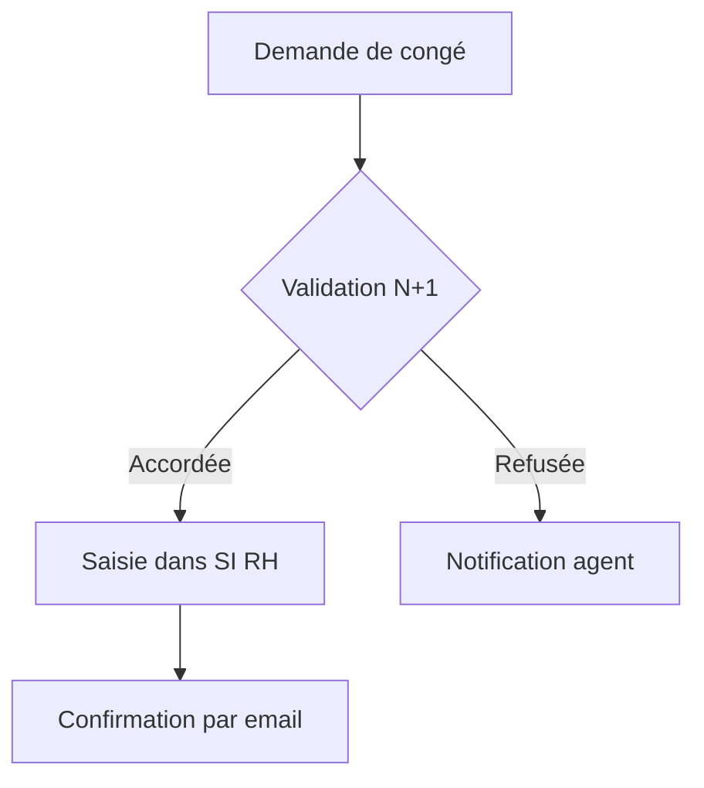
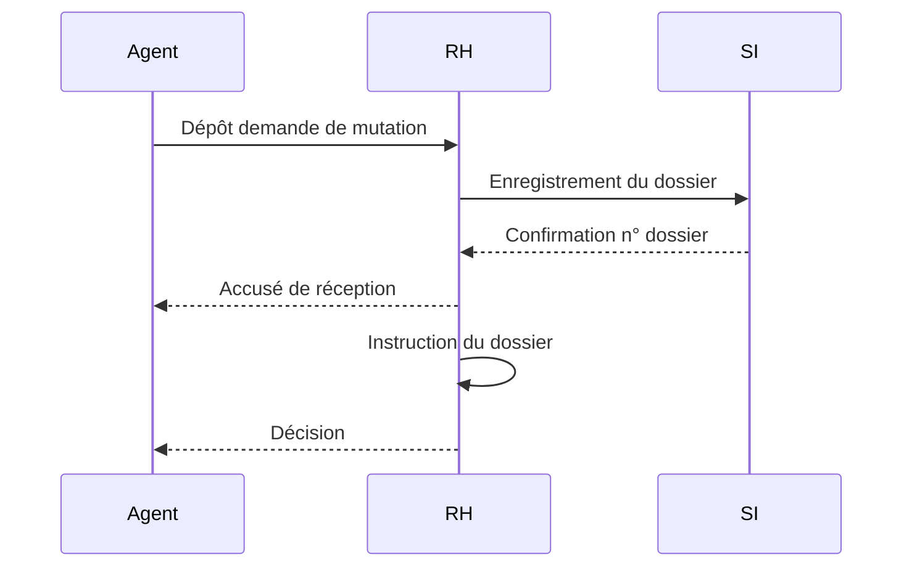
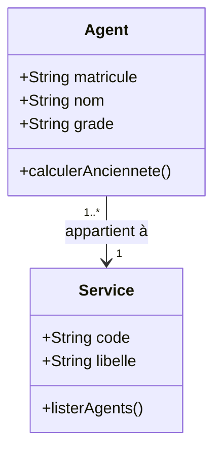
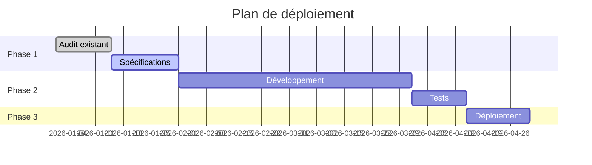
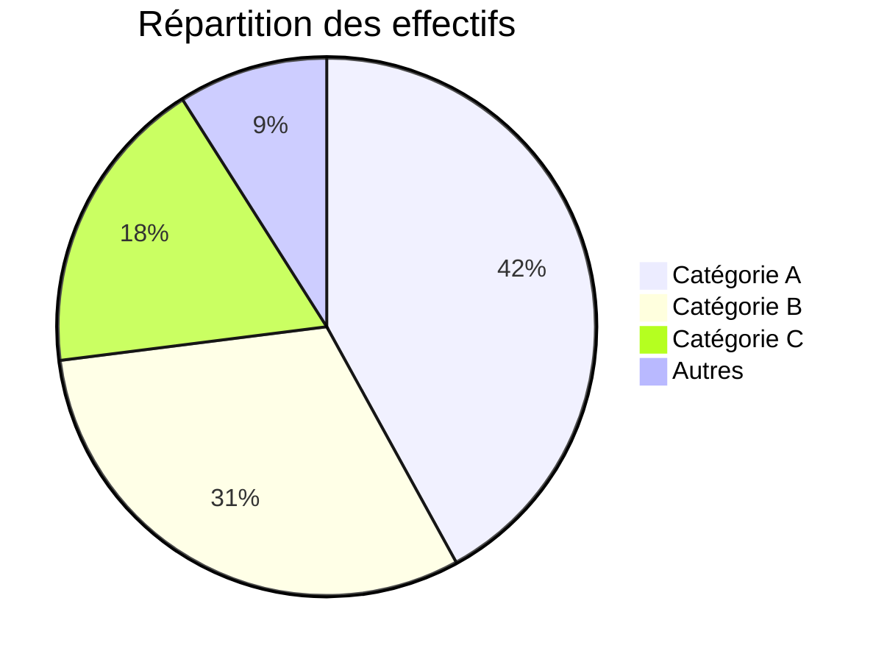
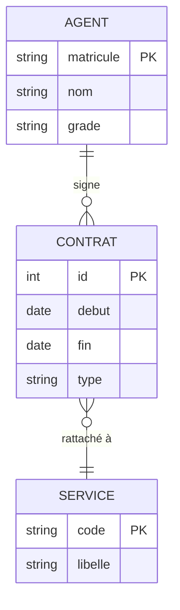

# Guide visualisation — Graphiques et schémas

Deux mécanismes complémentaires pour afficher des visuels directement dans la réponse.

---

## 1. Choisir le bon mécanisme

| Besoin | Mécanisme |
|---|---|
| Graphique de données (courbes, barres, camemberts, nuages de points…) | **Matplotlib** → image base64 |
| Schéma, diagramme, flowchart, séquence, organigramme… | **Mermaid** → syntaxe Markdown |
| Graphique interactif ou très complexe | Matplotlib + export PNG |
| Diagramme de classes, ER, Gantt, frise temporelle | Mermaid |

---

## 2. Graphiques Matplotlib — image inline

### Principe

Générer le graphique avec `python_exec`, l'exporter en PNG encodé en base64, puis l'insérer dans la réponse au format Markdown :

```

```

L'image est affichée directement dans la bulle de réponse sans fichier intermédiaire.

### Template de base

```python
import matplotlib
matplotlib.use("Agg")          # backend non-interactif — OBLIGATOIRE
import matplotlib.pyplot as plt
import io, base64

fig, ax = plt.subplots(figsize=(8, 5))

# ── Ton code de graphique ici ──────────────────────────
ax.plot([1, 2, 3, 4], [10, 24, 18, 35], marker="o", label="Série A")
ax.set_title("Mon graphique")
ax.set_xlabel("X")
ax.set_ylabel("Y")
ax.legend()
ax.grid(True, alpha=0.3)
# ──────────────────────────────────────────────────────

plt.tight_layout()
buf = io.BytesIO()
fig.savefig(buf, format="png", dpi=120, bbox_inches="tight")
plt.close(fig)
buf.seek(0)
b64 = base64.b64encode(buf.read()).decode()
print(f"")
```

**La dernière ligne `print(...)` est le mécanisme d'injection** — le résultat du `python_exec` est inclus dans la réponse Markdown et l'image s'affiche automatiquement.

### Règles impératives

- `matplotlib.use("Agg")` **TOUJOURS en premier**, avant tout autre import matplotlib. Sans ça, Matplotlib essaie d'ouvrir une fenêtre GUI et plante.
- `plt.close(fig)` après `savefig` pour libérer la mémoire.
- `dpi=120` est un bon compromis qualité/taille. Réduire à 96 pour les grandes figures, augmenter à 150 pour les graphiques détaillés.
- `figsize=(8, 5)` est la taille par défaut recommandée pour une bulle de 920px de large.

### Exemples par type de graphique

#### Barres groupées
```python
import matplotlib
matplotlib.use("Agg")
import matplotlib.pyplot as plt
import numpy as np
import io, base64

categories = ["Janv", "Févr", "Mars", "Avr"]
vals_a = [42, 38, 51, 47]
vals_b = [31, 29, 35, 33]
x = np.arange(len(categories))
width = 0.35

fig, ax = plt.subplots(figsize=(8, 5))
ax.bar(x - width/2, vals_a, width, label="2024", color="#2255A4")
ax.bar(x + width/2, vals_b, width, label="2025", color="#C0504D")
ax.set_xticks(x)
ax.set_xticklabels(categories)
ax.set_title("CA et Charges par mois")
ax.legend()
ax.grid(axis="y", alpha=0.3)
plt.tight_layout()
buf = io.BytesIO()
fig.savefig(buf, format="png", dpi=120, bbox_inches="tight")
plt.close(fig)
buf.seek(0)
b64 = base64.b64encode(buf.read()).decode()
print(f"")
```

#### Camembert
```python
import matplotlib
matplotlib.use("Agg")
import matplotlib.pyplot as plt
import io, base64

labels = ["Catégorie A", "Catégorie B", "Catégorie C", "Autres"]
sizes  = [38, 27, 22, 13]
colors = ["#2255A4", "#4DAF4A", "#FF7F00", "#999999"]
explode = (0.05, 0, 0, 0)

fig, ax = plt.subplots(figsize=(7, 5))
ax.pie(sizes, labels=labels, colors=colors, explode=explode,
       autopct="%1.1f%%", startangle=90)
ax.set_title("Répartition")
plt.tight_layout()
buf = io.BytesIO()
fig.savefig(buf, format="png", dpi=120, bbox_inches="tight")
plt.close(fig)
buf.seek(0)
b64 = base64.b64encode(buf.read()).decode()
print(f"")
```

#### Plusieurs graphiques côte à côte
```python
import matplotlib
matplotlib.use("Agg")
import matplotlib.pyplot as plt
import io, base64

fig, (ax1, ax2) = plt.subplots(1, 2, figsize=(12, 5))

ax1.plot([1,2,3,4,5], [10,24,18,35,29], marker="o", color="#2255A4")
ax1.set_title("Évolution")
ax1.grid(True, alpha=0.3)

ax2.bar(["A","B","C"], [42,31,27], color=["#2255A4","#C0504D","#4DAF4A"])
ax2.set_title("Comparaison")

plt.tight_layout()
buf = io.BytesIO()
fig.savefig(buf, format="png", dpi=120, bbox_inches="tight")
plt.close(fig)
buf.seek(0)
b64 = base64.b64encode(buf.read()).decode()
print(f"")
```

---

## 3. Diagrammes Mermaid — schémas natifs

### Principe

Écrire un bloc de code avec la mention `mermaid`. Le diagramme est rendu en SVG directement dans la bulle de réponse, sans aucun appel Python.

### Flowchart / Organigramme

````

````

Directions disponibles : `TD` (haut→bas), `LR` (gauche→droite), `BT` (bas→haut), `RL` (droite→gauche).

### Diagramme de séquence

````

````

### Diagramme de classes

````

````

### Gantt

````

````

### Camembert Mermaid (données simples)

````

````

### Diagramme ER

````

````

---

## 4. Bonnes pratiques

- **Toujours inclure un titre** dans les graphiques Matplotlib (`ax.set_title()`).
- **Privilégier Mermaid** pour les schémas conceptuels — plus rapide à produire, thème cohérent avec l'interface.
- **Utiliser Matplotlib** dès que les données sont numériques et que la précision visuelle compte.
- **Ne pas combiner** les deux dans la même réponse sauf si les deux apportent une valeur distincte.
- **Pour les grandes séries de données** (>1000 points), sous-échantillonner avant de tracer pour éviter les images trop lourdes.

---

## 5. Pièges de syntaxe Mermaid à éviter

Le parser Mermaid est strict. Ces erreurs produisent `Syntax error` ou `Uncaught #<Object>` :

### Labels de nœuds — caractères interdits

Dans les flowcharts, les labels entre `[]`, `()`, `{}` ne doivent pas contenir de parenthèses, guillemets ou apostrophes non échappés.

```
❌  A[Validation (RH)]
✅  A[Validation RH]

❌  B[Vérifier l'identité]
✅  B[Vérifier identite]
✅  B["Vérifier l'identité"]   ← guillemets doubles autorisés en Mermaid 10+
```

### Accents et caractères spéciaux

Les accents sont en général supportés, mais certains caractères posent problème dans les labels sans guillemets.
**Règle simple :** mettre les labels contenant des caractères spéciaux entre guillemets doubles.

```
✅  A["Décision d'autorité"]
✅  B["Résultat : accepté"]
```

### Longueur des labels

Les labels trop longs (> 50 caractères) peuvent casser le rendu SVG. Raccourcir ou passer à la ligne avec `<br/>` :

```
✅  A["Publication du poste<br/>sur Place de l'Emploi Public"]
```

### Noms de nœuds

Les identifiants de nœuds (`A`, `B`, `step1`…) ne doivent pas contenir d'espaces ni de caractères spéciaux.

```
❌  validation RH --> traitement
✅  valRH --> traitement
```

### Flowchart vs graph

Préférer `flowchart TD` à `graph TD` — syntaxe plus robuste avec Mermaid 10+.

```
✅  flowchart TD
❌  graph TD    ← toujours supporté mais moins stable avec les labels complexes
```

---

## 6. Erreurs fréquentes

| Erreur | Correction |
|---|---|
| `UserWarning: Matplotlib is currently using TkAgg` | Ajouter `matplotlib.use("Agg")` **avant** `import matplotlib.pyplot` |
| Image non affichée | Vérifier que le `print(f"")` est bien la dernière instruction |
| Diagramme Mermaid affiché en texte brut | Vérifier que `mermaid.min.js` est installé (`python scripts/download_mermaid.py`) |
| `Syntax error in text` dans Mermaid | Label contenant `()`, `'` ou `"` — les mettre entre guillemets doubles |
| `Uncaught #<Object>` dans la console | Idem — caractère spécial dans un label, ou label trop long |
| Graphique coupé | Utiliser `bbox_inches="tight"` dans `savefig` |
| Image trop lourde / lente | Réduire `dpi` (96 au lieu de 120) ou `figsize` |
