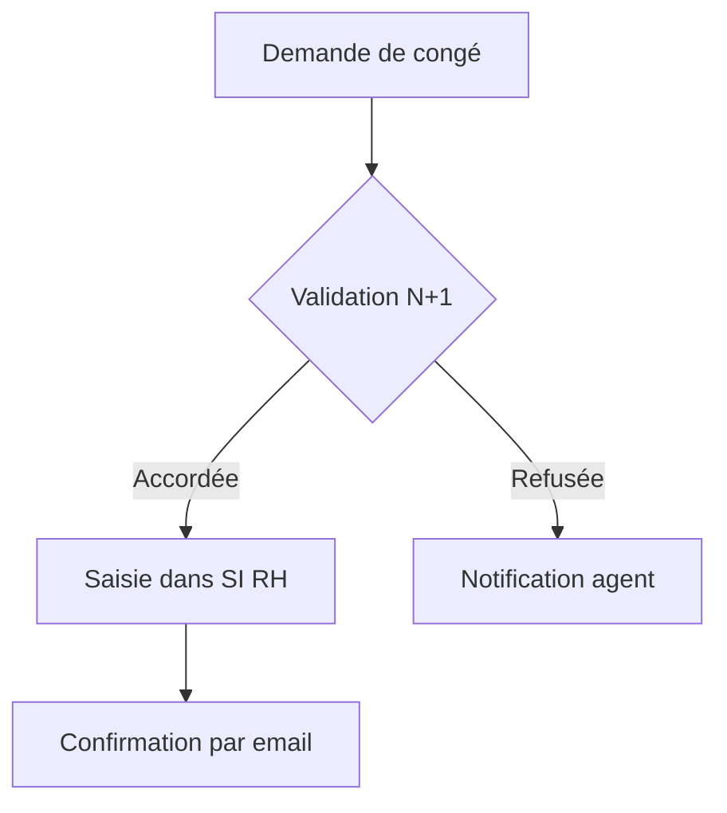
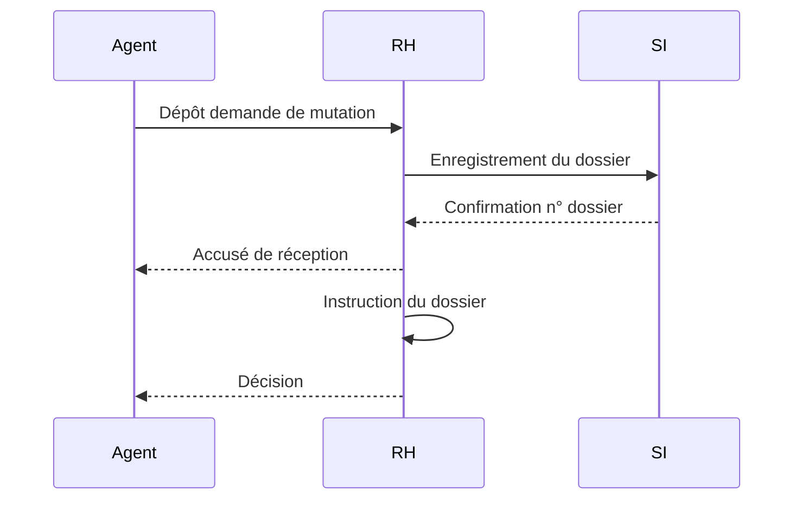
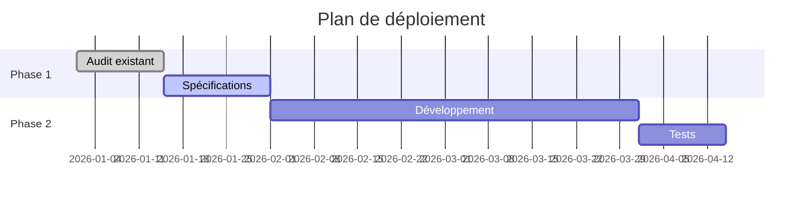
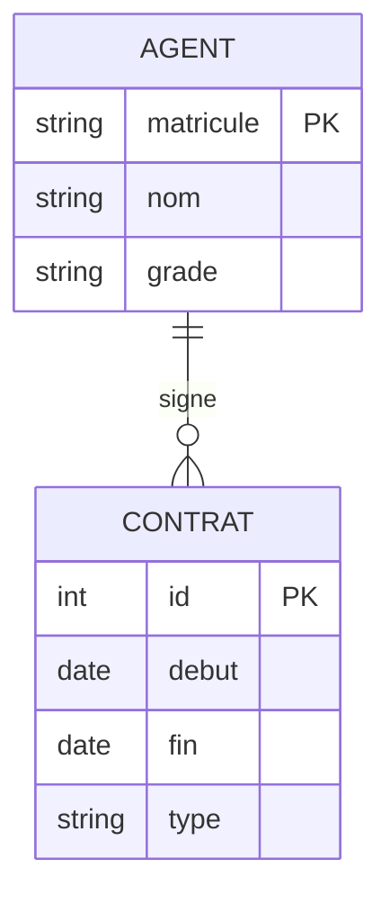

# Guide visualisation — Graphiques et schémas

> ## 🚫 STOP — LIS CECI AVANT TOUT
>
> **Format de sortie pour un graphique ECharts — UN SEUL format autorisé :**
>
> ````
> ```echarts
> { ... config JSON ... }
> ```
> ````
>
> **TOUT LE RESTE EST INTERDIT :**
> - ❌ Code HTML (`<!DOCTYPE html>`, `<script>`, `<canvas>`, CDN ECharts)
> > - ❌ Fichier `.html` ou `.py` à télécharger
> - ❌ Prose explicative avant le graphique
>
> Si tu t'apprêtes à écrire `<!DOCTYPE` ou `import echarts` → **STOP, recommence avec le bloc ```echarts.**

Trois mécanismes complémentaires pour afficher des visuels directement dans la réponse.

---

## 1. Choisir le bon mécanisme

| Besoin | Mécanisme |
|---|---|
| Graphique interactif depuis des données (histogramme, camembert, barres, courbes, nuage de points…) | **ECharts** → bloc ```echarts` avec JSON |
| Graphique statique avancé ou calcul Python requis avant le tracé | **Matplotlib** → affiché automatiquement |
| Schéma, diagramme, flowchart, séquence, organigramme… | **Mermaid** → syntaxe Markdown |
| Diagramme de classes, ER, Gantt, frise temporelle | **Mermaid** |

**Règle générale :** Dès que l'utilisateur demande un graphique *à partir de données* (CSV, tableau, liste de valeurs), utiliser **ECharts** en priorité — le graphique sera interactif (zoom, tooltip, légende). Utiliser Matplotlib uniquement si un pré-traitement Python complexe est nécessaire avant de tracer.

---

## 2. Graphiques ECharts — interactifs, config JSON

### Principe

Écrire un bloc de code avec la mention `echarts`. La config est du **JSON standard Apache ECharts**.
Le graphique est rendu directement dans la bulle, avec zoom, tooltip et légende cliquables.

### ⚠ RÈGLES IMPÉRATIVES

- **JAMAIS de HTML** : ne jamais produire un fichier `.html` ni du code `<!DOCTYPE html>` / `<script src="echarts...">` pour afficher un graphique. L'application embarque déjà ECharts côté client. Produire uniquement le bloc ` ```echarts ` JSON ci-dessous — c'est la seule façon pour que le graphique s'affiche dans la bulle de réponse.
- La config doit être du **JSON valide** : toutes les clés entre guillemets doubles, pas de virgule finale.
- **Ne pas inclure de commentaires** `//` ou `/* */` — JSON pur uniquement.
- Ne pas utiliser de valeurs JS brutes : `NaN`, `Infinity`, `undefined` → utiliser `null`.
- Pour les dates, utiliser des chaînes `"2024-01-01"` — ECharts les reconnaît automatiquement.
- Ne pas définir `backgroundColor` — l'application gère le thème dark/light automatiquement.
- Toujours inclure un `title.text` descriptif avec `"left": "center"`.
- Les `formatter` peuvent être des chaînes de template ECharts : `"{b}: {c}"` — pas de fonctions JS.
- Pour les graphiques sans `xAxis`/`yAxis` (pie, radar, funnel, gauge…), ne pas inclure ces axes.
- **Toujours inclure `"grid": { "containLabel": true, "left": "3%", "right": "4%", "bottom": "15%", "top": "80px" }`** pour éviter que les libellés d'axes soient rognés.
- **Légende en bas** : toujours positionner la légende sous le graphique avec `"legend": { "bottom": 0, "type": "scroll" }` sauf si l'espace le permet autrement. Cela libère la largeur horizontale pour les barres.
- **Rotation des étiquettes X** : si les libellés de l'axe X sont longs (> 8 caractères), ajouter `"axisLabel": { "rotate": 30, "interval": 0 }` sur l'`xAxis`.

### Histogramme (barres)

````
```echarts
{
  "title": { "text": "Ventes mensuelles 2025" },
  "tooltip": { "trigger": "axis" },
  "xAxis": {
    "type": "category",
    "data": ["Jan", "Fév", "Mar", "Avr", "Mai", "Jun"]
  },
  "yAxis": { "type": "value", "name": "k€" },
  "series": [{
    "name": "Ventes",
    "type": "bar",
    "data": [120, 200, 150, 180, 210, 175],
    "itemStyle": { "color": "#5470c6" }
  }]
}
```
````

### Camembert

````
```echarts
{
  "title": { "text": "Répartition des effectifs", "left": "center" },
  "tooltip": { "trigger": "item" },
  "legend": { "orient": "vertical", "left": "left" },
  "series": [{
    "name": "Effectifs",
    "type": "pie",
    "radius": "60%",
    "data": [
      { "value": 42, "name": "Catégorie A" },
      { "value": 31, "name": "Catégorie B" },
      { "value": 18, "name": "Catégorie C" },
      { "value": 9,  "name": "Autres" }
    ],
    "emphasis": {
      "itemStyle": { "shadowBlur": 10, "shadowOffsetX": 0, "shadowColor": "rgba(0,0,0,0.5)" }
    }
  }]
}
```
````

### Courbe d'évolution

````
```echarts
{
  "title": { "text": "Évolution du CA" },
  "tooltip": { "trigger": "axis" },
  "xAxis": {
    "type": "category",
    "data": ["2020", "2021", "2022", "2023", "2024", "2025"]
  },
  "yAxis": { "type": "value", "name": "M€" },
  "series": [{
    "name": "CA",
    "type": "line",
    "data": [1.2, 1.5, 1.8, 2.1, 2.6, 3.1],
    "smooth": true,
    "areaStyle": {}
  }]
}
```
````

### Barres groupées (comparaison)

````
```echarts
{
  "title": { "text": "Comparaison budgétaire", "left": "center" },
  "tooltip": { "trigger": "axis", "axisPointer": { "type": "shadow" } },
  "legend": { "bottom": 0, "type": "scroll" },
  "grid": { "containLabel": true, "left": "3%", "right": "4%", "bottom": "15%", "top": "80px" },
  "xAxis": {
    "type": "category",
    "data": ["T1", "T2", "T3", "T4"],
    "axisLabel": { "interval": 0 }
  },
  "yAxis": { "type": "value" },
  "series": [
    { "name": "Prévu",   "type": "bar", "data": [320, 332, 301, 334] },
    { "name": "Réalisé", "type": "bar", "data": [290, 310, 340, 290] }
  ]
}
```
````

### Nuage de points (scatter)

````
```echarts
{
  "title": { "text": "Corrélation taille / poids" },
  "tooltip": { "trigger": "item" },
  "xAxis": { "type": "value", "name": "Taille (cm)" },
  "yAxis": { "type": "value", "name": "Poids (kg)" },
  "series": [{
    "type": "scatter",
    "data": [[160,55],[170,65],[175,72],[155,48],[180,80],[165,60]]
  }]
}
```
````

### Radar

````
```echarts
{
  "title": { "text": "Évaluation des compétences" },
  "tooltip": {},
  "radar": {
    "indicator": [
      { "name": "Technique",      "max": 100 },
      { "name": "Communication",  "max": 100 },
      { "name": "Organisation",   "max": 100 },
      { "name": "Initiative",     "max": 100 },
      { "name": "Travail équipe", "max": 100 }
    ]
  },
  "series": [{
    "type": "radar",
    "data": [{
      "value": [85, 70, 90, 65, 80],
      "name": "Agent A"
    }]
  }]
}
```
````

### Entonnoir / Funnel

````
```echarts
{
  "title": { "text": "Entonnoir de conversion", "left": "center" },
  "tooltip": { "trigger": "item", "formatter": "{b}: {c}%" },
  "series": [{
    "type": "funnel",
    "left": "10%",
    "width": "80%",
    "data": [
      { "value": 100, "name": "Visiteurs" },
      { "value": 60,  "name": "Inscrits" },
      { "value": 35,  "name": "Actifs" },
      { "value": 15,  "name": "Convertis" }
    ]
  }]
}
```
````

### Jauge / Gauge

````
```echarts
{
  "title": { "text": "Taux de satisfaction", "left": "center" },
  "series": [{
    "type": "gauge",
    "progress": { "show": true },
    "detail": { "formatter": "{value}%" },
    "data": [{ "value": 73, "name": "Score" }]
  }]
}
```
````

### Heatmap / Calendrier

````
```echarts
{
  "title": { "text": "Activité hebdomadaire" },
  "tooltip": { "position": "top" },
  "xAxis": {
    "type": "category",
    "data": ["Lun", "Mar", "Mer", "Jeu", "Ven"],
    "splitArea": { "show": true }
  },
  "yAxis": {
    "type": "category",
    "data": ["S1", "S2", "S3", "S4"],
    "splitArea": { "show": true }
  },
  "visualMap": { "min": 0, "max": 20, "calculable": true },
  "series": [{
    "type": "heatmap",
    "data": [
      [0,0,5],[1,0,12],[2,0,8],[3,0,15],[4,0,3],
      [0,1,9],[1,1,7],[2,1,18],[3,1,4],[4,1,11],
      [0,2,2],[1,2,14],[2,2,6],[3,2,19],[4,2,7],
      [0,3,10],[1,3,3],[2,3,13],[3,3,8],[4,3,16]
    ],
    "label": { "show": true }
  }]
}
```
````

### Workflow depuis un fichier CSV

Quand l'utilisateur fournit un fichier CSV **et que les données sont déjà disponibles dans le contexte** (tableau collé, valeurs connues, fichier déjà lu), produire **directement** le bloc ` ```echarts ` — sans appel Python intermédiaire.

> **RÈGLE ABSOLUE : si l'utilisateur écrit "crée un graphique echarts à partir de ces données" (ou formulation similaire), répondre UNIQUEMENT avec le bloc ` ```echarts ` JSON. Ne jamais ajouter de code Python, d'explication de lecture CSV, ni aucune autre prose avant le graphique.**

Python (`python_exec`) n'est nécessaire que dans un seul cas : le fichier CSV est stocké dans le VFS et ses valeurs ne sont **pas encore connues**. Dans ce cas uniquement :

1. Lire le CSV via `python_exec` pour en extraire les valeurs
2. Puis générer le bloc ` ```echarts ` avec les vraies valeurs extraites — sans afficher le code Python dans la réponse finale

---

## 3. Graphiques Matplotlib — affichage automatique

À utiliser quand : pré-traitement Python complexe, calculs statistiques avancés, subplots multiples, personnalisation graphique très poussée.

### ⚠ RÈGLE CRITIQUE — ne jamais imprimer la data-URI

**L'application affiche automatiquement tout graphique matplotlib généré dans `python_exec`.**
Il n'est **jamais** nécessaire (ni souhaitable) d'encoder l'image en base64 et de l'imprimer.

```
❌ INTERDIT — ne jamais faire :
    buf = io.BytesIO()
    fig.savefig(buf, ...)
    b64 = base64.b64encode(buf.read()).decode()
    print(f"")   ← NE PAS FAIRE

✅ CORRECT — appeler simplement plt.show() ou plt.savefig() :
    plt.tight_layout()
    plt.show()   ← l'application intercepte et affiche l'image automatiquement
```

### Template de base

```python
import matplotlib
matplotlib.use("Agg")          # backend non-interactif — OBLIGATOIRE
import matplotlib.pyplot as plt

fig, ax = plt.subplots(figsize=(8, 5))

# ── Ton code de graphique ici ──────────────────────────
ax.plot([1, 2, 3, 4], [10, 24, 18, 35], marker="o", label="Série A")
ax.set_title("Mon graphique")
ax.set_xlabel("X")
ax.set_ylabel("Y")
ax.legend()
ax.grid(True, alpha=0.3)
# ──────────────────────────────────────────────────────

plt.tight_layout()
plt.show()   # ← déclenche l'affichage automatique, NE PAS encoder en base64
```

### Règles impératives

- `matplotlib.use("Agg")` **TOUJOURS en premier**, avant tout autre import matplotlib.
- `plt.close(fig)` après `plt.show()` pour libérer la mémoire (optionnel mais recommandé).
- `dpi=150` est un bon compromis qualité/taille.
- **Ne jamais** imprimer de data-URI base64 — utiliser `plt.show()`.

---

## 4. Diagrammes Mermaid — schémas natifs

### Principe

Écrire un bloc de code avec la mention `mermaid`. Le diagramme est rendu en SVG directement dans la bulle de réponse, sans aucun appel Python.

### Flowchart / Organigramme

````

````

### Diagramme de séquence

````

````

### Gantt

````

````

### Diagramme ER

````

````

---

## 5. Bonnes pratiques

- **ECharts en priorité** pour tous les graphiques de données — interactif, léger, JSON pur.
- **Matplotlib** quand Python doit calculer quelque chose avant de tracer.
- **Mermaid** pour les schémas conceptuels — plus rapide, thème cohérent.
- **Toujours inclure un titre** dans les graphiques ECharts (`title.text`) et Matplotlib (`ax.set_title()`).
- **Pour les grandes séries** (>1000 points), sous-échantillonner avant de tracer.

---

## 6. Erreurs fréquentes

| Erreur | Correction |
|---|---|
| LLM produit un fichier HTML au lieu d'un graphique inline | Ne jamais écrire `<!DOCTYPE html>` ni `<script src="echarts...">` — utiliser uniquement le bloc ` ```echarts ` JSON |
| LLM génère du code Python avant le graphique ECharts | Si les données sont déjà connues, produire **directement** le bloc ` ```echarts ` — aucun appel Python n'est nécessaire |
| Config ECharts non affichée | Vérifier que le JSON est valide : clés entre guillemets doubles, pas de commentaires `//` |
| Graphique ECharts vide ou ⚠️ | Ne pas inclure `xAxis`/`yAxis` pour les types `pie`, `radar`, `funnel`, `gauge` |
| Graphique ECharts — NaN/undefined | Remplacer `NaN`, `Infinity`, `undefined` par `null` dans la config |
| Tooltip avec `formatter` invalide | Utiliser un template string ECharts `"{b}: {c}"` — jamais une fonction JS |
| `UserWarning: Matplotlib is currently using TkAgg` | Ajouter `matplotlib.use("Agg")` **avant** `import matplotlib.pyplot` |
| Image Matplotlib non affichée | Vérifier que `plt.show()` est bien appelé (NE PAS encoder en base64) |
| Diagramme Mermaid affiché en texte brut | Vérifier l'installation de mermaid.js |
| `Syntax error in text` dans Mermaid | Label contenant `()`, `'` — les mettre entre guillemets doubles |
